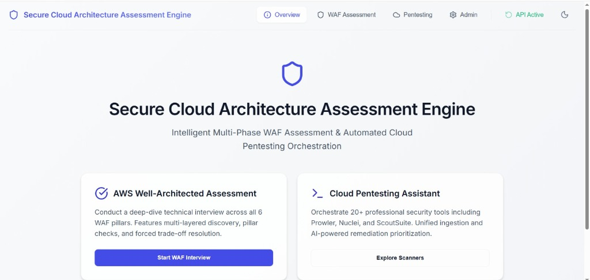
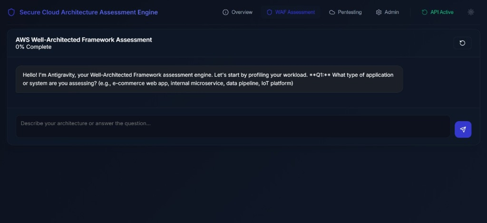
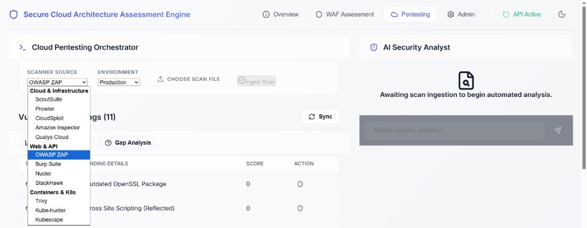
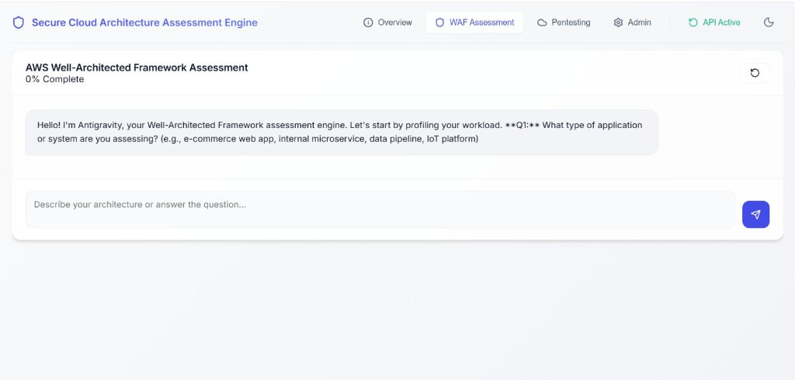

# CloudSecurityApp: Advanced WAF Assessment & DAST Triage Engine

CloudSecurityApp is an AI-powered system designed to automate AWS Well-Architected Framework (WAF) assessments and ingest dynamic application security testing (DAST) scans, triaging findings using large language models.

## 🖼️ System Previews





## 🚀 Features
- **Conversational WAF Assessment**: Uses LLMs to guide users through architectural best practices across operational excellence, security, reliability, performance, and cost. It dynamically generates comprehensive technical interviews and scores your architecture.
- **Unified DAST & CSPM Ingestion**: Parses over 15+ scanner formats (OWASP ZAP, Burp Suite, Nuclei, Checkov, Prowler) into a unified threat model, allowing security teams to have a single pane of glass.
- **Intelligent Triage & Remediation**: Uses extremely fast LLMs to analyze findings, summarize threats, and generate actionable remediation roadmaps tailored to your workload profile.
- **RAG Knowledge Base**: Upload architectural documents (PDFs) to automatically provide context to the integrated AI engine, converting them to vector embeddings for seamless context fetching during pentesting analysis.

## 🧠 AI Engine: Powered by Groq
This system integrates natively with **[Groq](https://groq.com/)**, the creators of the Language Processing Unit (LPU™). Groq provides deterministic, ultra-low latency AI inference, allowing the conversational agents and vulnerability triage assistants in this app to respond in real-time. 
- Fast LLM models used: `llama3-70b-8192` or `llama3-8b-8192`.
- You will need a standard Groq API key to power this backend. Register at [GroqCloud](https://console.groq.com/).

## 💾 Database Architecture
The application uses **SQLAlchemy** to interface with multiple database engines, supporting both local development and scalable production:
- **Local Development**: By default, it sets up an **SQLite** database (`dast_db.sqlite`). It requires zero configuration, perfect for testing and single-user instances.
- **Production Environment**: Designed for **MySQL 8.0**. The included `docker-compose.yml` natively spins up a robust MySQL container utilizing the `schema.sql` for table seeding. Use secure passwords passed through environment variables.

---

## 🛠️ Installation Guide

### Prerequisites
- [Node.js & npm](https://nodejs.org/en) (for building the user interface)
- Python 3.9+ 
- (Optional) Docker Desktop
- A [GroqCloud API Key](https://console.groq.com/keys)

### 1. Local Development (Windows / macOS / Linux)
1. **Clone the repo** and navigate to the root directory.
2. **Configure Environment Variables:**
   - Rename `.env.example` to `.env` in the root folder.
   - Insert your `GROQ_API_KEY=gsk_...` inside `.env`.
   - Rename `ui/.env.example` to `ui/.env`.
3. **Start the ecosystem:**
   - **Windows Users**: Run the `.\start.ps1` script. This automatically provisions the Python backend, installs Node modules if missing, and boots the React Vite development server concurrently.
   - **Manual Start**:
     - Backend: `pip install -r requirements.txt` then `uvicorn api:app --reload`
     - Frontend: `cd ui`, `npm install`, `npm run dev`

### 2. Docker Deployment (Recommended for Production)
1. Ensure Docker Desktop is running.
2. In the root directory, configure your `.env` file first.
3. Build and launch the containers:
   ```bash
   docker-compose up --build -d
   ```
4. Access the web interface at `http://localhost:5173`.
5. Stop the services:
   ```bash
   docker-compose down
   ```

---

## 📖 How to Use the System

The platform is split into three main navigational tabs to organize your workflow:

### 1. WAF Assessment (Well-Architected Framework)
- **Start an Interview**: Under the WAF Assessment tab, initialize a new session. Provide your architectural context (e.g., "I have a stateless microservice in EKS behind an Application Load Balancer").
- **Answer the AI**: The engine will intelligently prompt you about the 6 AWS Pillars: *Security, Reliability, Performance Efficiency, Cost Optimization, Operational Excellence, and Sustainability*.
- **Generate Report**: Once the dynamic 25-question progression completes, hit **Download Assessment Report** to receive a structured PDF with maturity scores, executive summaries, and action items.

### 2. Cloud Pentesting Orchestrator
- **Upload Scans**: Navigate to the Pentesting tab. Select the vulnerability source (e.g., OWASP ZAP, Prowler, or Checkov) and upload your `.json` or `.xml` reports. The backend instantly normalizes them.
- **Chat with the Analyst**: On the right panel, prompt the AI Analyst (e.g., *"How do I mitigate this Cross-Site Scripting (Reflected) finding?"*). Groq's high-speed inference provides immediate technical code snippets specific to your stack.
- **Summarize & Clarify**: Use the "Gap Analysis" and "Summarize Results" action buttons to get an executive breakdown of your entire vulnerability posture.

### 3. Admin & RAG (Knowledge Base)
- **Provide Authorization Key**: At the top right, insert your API key matching the backend `API_KEY_SALT` to unlock admin features.
- **Upload Assets**: Manage your Vector Database by uploading PDF files outlining your unique system architecture. The LLM will now reference these documents autonomously during pentesting analysis.

---

## 🗂️ Examples & Generated Artifacts
For templates and actual outputs generated by this system (including extended logs, testing reports in CSV format, and generated PDFs), refer to the root folder: **`example_of_using_the_system/`**.

---

## Contributing
1. Fork the repository.
2. Create a feature branch: `git checkout -b feature/awesome-feature`
3. Commit your changes: `git commit -m "feat: Add awesome feature"`
4. Push to the branch: `git push origin feature/awesome-feature`
5. Open a Pull Request.
